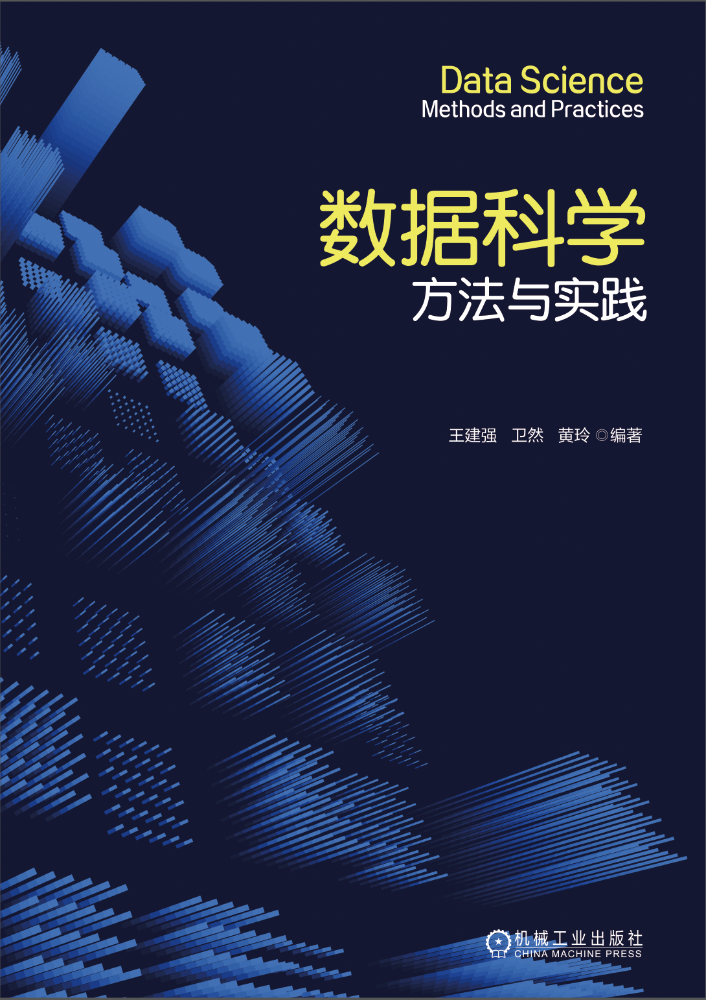

# Large Language Models: A Deep Dive

This repository contains expanded tutorials and python notebooks to accompany the book Building Recommender Systems Using Large Language Models by Jay.

 

## About this repository

Within the eight chapter folders, you will find nine total tutorials (chapter 3 has two separate tutorials) displayed in markdown format, accompanied by a Python notebook that runs through the calculations. The tutorials are expanded versions of the tutorials that appear at the end of chapters 2-9 in the published book. These tutorials are designed to provide the most value if you follow these steps.

1. Read the chapter in the book.

2. Look at the markdown tutorial and open the notebook in Jupyter notebook. They are designed to compliment each other, with the notebook containing all the details of the calculations and the tutorial providing a more narrative description of the details. 

3. Read through the markdown text while running the corresponding cells in the tutorial.

4. Adapt, and build upon the notebooks for your particular use-cases.

## How to use the notebooks

Notebooks can be run on local GPU resources or through booting a Google Colab instance on the imported notebook. 

The tuturials were tested and run in Python 3.10. Where appropriate, we have hard-coded package versions to avoid incompatability issues. 

## Prerequisites

You will need to create accounts and download API tokens from several websites in order to smoothly run every tutorial notebook. Here is a list of accounts that will be needed to run each of the notebooks.

## About the book

Integrating Large Language Models (LLMs) into recommendation systems is transforming personalized recommendations, addressing limitations of traditional methods with advanced context awareness and user understanding. As personalization becomes central to user engagement and business success, mastering LLM-driven recommendations is essential for staying at the forefront of AI innovation.

This book covers the fundamentals of LLMs and traditional recommendation systems, practical integration techniques like user modeling and fine-tuning, and advanced topics such as conversational recommenders and knowledge distillation. It also explores future trends, ethical challenges, and the evolving landscape of LLM-based recommendations, supported by real-world examples and case studies.

Readers will learn to design and implement LLM-powered recommendation systems, overcoming traditional limitations and applying cutting-edge techniques. With actionable insights and practical guidance, the book equips them to innovate, optimize personalization, and stay competitive in the rapidly advancing AI field.

Key Features:

## About the author

* **Jianqiang (Jay) Wang** is an seasoned data science professional with a Ph.D. in Statistics and extensive experience across academia and industry. Formerly a Principal Applied Science Manager at Microsoft, Jay has also held multiple roles, including Visiting Professor at Colorado State University, Data Scientist at Twitter, Lead Data Scientist at Snap, and Director of Data Science at Kuaishou. His expertise spans backend algorithms for search advertising, customer growth, inventory management, and data science education, with a particular focus on internet advertising and emerging retail business models.

[Linkedin](https://www.linkedin.com/in/jay-jianqiang-wang-78a6726/)
